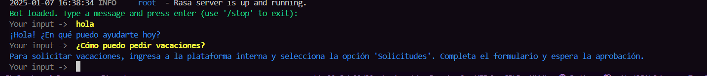
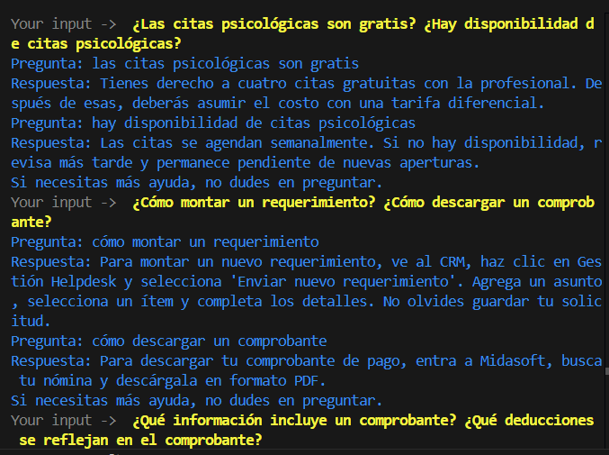

# Configuración del Proyecto para Rasa Chatbot

### Pre-requisitos

Para poder configurar y ejecutar este modelo correctamente necesita:
- Microsoft Visual C++ Build Tools
- Python3.8
- PostgreSQL
- setuptools==58.0.4

Para comenzar con el chatbot en Rasa, sigue los pasos a continuación:

1. **Crear un entorno virtual**:  
   Crea un entorno virtual para tu proyecto.
   ```bash
   python3.8 -m venv venv
   ```

2. **Activar el entorno virtual**:  
   En Windows, activa el entorno virtual con el siguiente comando:
   ```bash
   .\venv\Scripts\activate
   ```

3. **Instalar dependencias**:  
   Instala la biblioteca `psycopg2` para la conexión a bases de datos PostgreSQL:
   ```bash
   pip install psycopg2-binary==2.9.3
   pip install fire==0.4.0
   pip install sentence_transformers
   ```

4. **Instalar Rasa y Spacy**:  
   Instala Rasa junto con el soporte para Spacy:
   ```bash
   pip install rasa[spacy]
   ```

5. **Descargar el modelo de Spacy para Español y el modelo de embedding**:  
   Descarga el modelo de Spacy para procesamiento en español:
   ```bash
   python -m spacy download es_core_news_sm
   python descarga.py
   ```

---

### 🚀 Entrenamiento del Modelo

Para entrenar el chatbot, ejecute el siguiente comando:

```bash
rasa train
rasa shell
```



### ⚙️ Ejecutar el archivo Actions

Para el apropiado funcionamiento del modelo se necesita la ejecución alterna de los actions en otra terminal:

```bash
rasa run actions
```

### 🔴 **Desactivar el entorno virtual**

Para desactivar el entorno virtual, usa el siguiente comando:

```bash
deactivate
```

